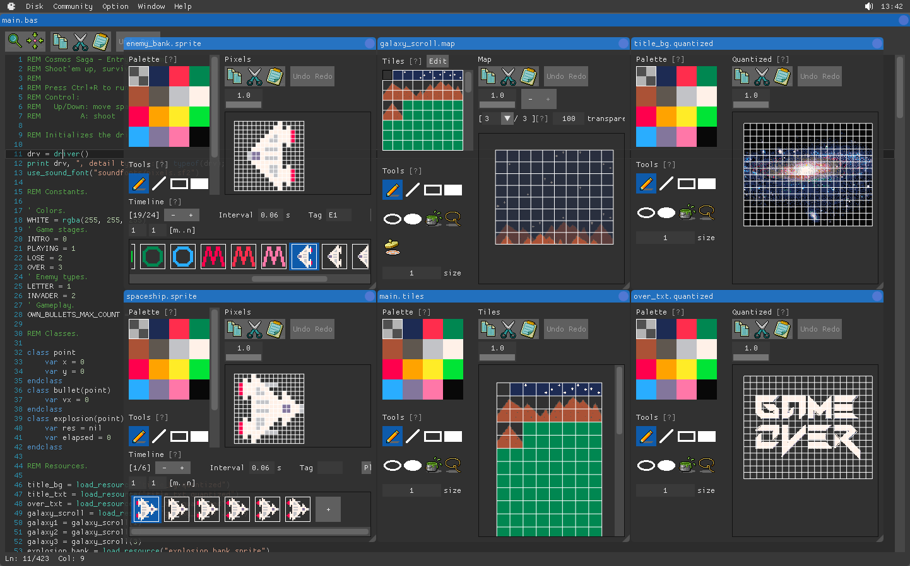

## Awesome

This is a list of awesome projects powered by [MY-BASIC](https://github.com/paladin-t/my_basic/).

## Categories

### Embedded

* [Debian Package Repository](http://repo.munts.com/debian9) - Munts Technologies Debian package

* [Linux Simple I/O Library](http://git.munts.com/libsimpleio) - A library to communicate through Linux kernel A/D inputs, GPIO pins, and PWM outputs

* [MuntsOS Embedded Linux](http://git.munts.com/arm-linux-mcu) - An embedded Linux framework on single board microcomputers

### Graphics/Game/Engine

* [AGE](https://github.com/paladin-t/ascii_game_engine/) - A game engine with ASCII style rendering
	* MY-BASIC as a configuration and scripting language.

* [AllegroBASIC](http://allegrobasic.pulsar2d.org/) - A classical BASIC dialect which let you code your own little programs with emphasis on drawing graphics primitives
	* MY-BASIC as a programming tool.

* [BASIC8](https://paladin-t.github.io/b8/) - A fantasy computer for game and other program development
	* MY-BASIC as a programming language.

* [Flexible Menu System](https://github.com/my-basic/awesome/issues/1)
	* MY-BASIC as a scripting language.

* [Nasl](https://github.com/jacmoe/nasl/) - Nasl is Not A Sixteen-bit Library
	* MY-BASIC as a scripting language.

### Tool

* [MY-BASIC Code Editor Unity](https://github.com/my-basic/code_editor_unity/) - A code editor for MY-BASIC powered by the Unity3D engine
	* MY-BASIC as the target language.

* [ScriptBasic](http://scriptbasic.com/) - A free BASIC interpreter
	* MY-BASIC as an extension module.

### Web

* [WWIV BBS Software](http://www.wwivbbs.org/) - A computer bulletin board system (BBS)
	* MY-BASIC as a programming tool.

## Contribution

Pull requests are welcome!

1. Can be any type of apps, web sites, video games, or even a toaster in the real world, etc.
2. Must provide at least a URL or an image
3. See existing files for naming rules to make PR
4. Ordered by alphabet
